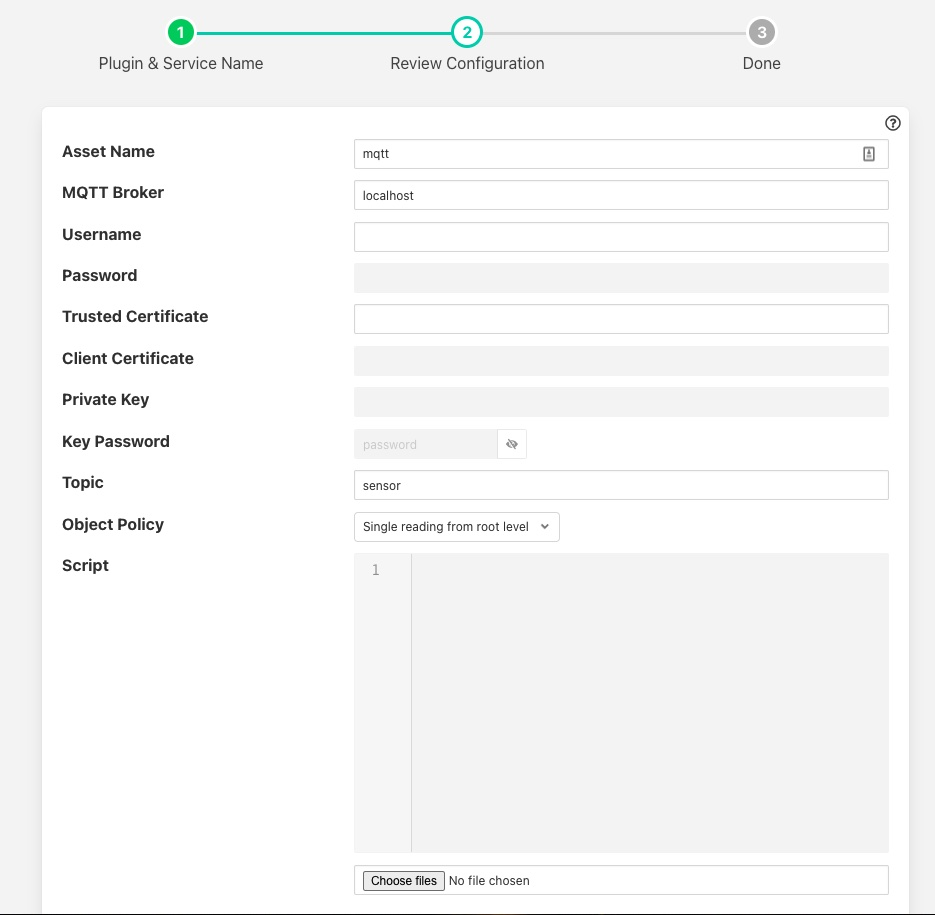
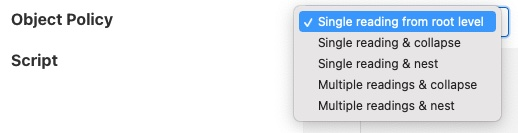

.. Images

MQTT South with Payload Scripting
=================================

The *foglamp-south-mqtt-scripted* plugin uses MQTT to receive messages via an MQTT broker from sensors or other sources. It then uses an optional script, written is Python, that converts the message into a JSON document and pushes data to the FogLAMP System.

If the payload of the MQTT message is a JSON document with simple key/value pairs, e.g.

.. code-block:: json

   { "temperature" : 23.1, "humidity" : 47.2 }

Then no translation script is required. Also if the payload is a simple
numeric value the plugin will accept this and create an asset with
the data point name matching the topic on which the value was given in
the payload.

If the message format is not a simple JSON document or a single value,
or is in some other format then a Python script should be provided that
turns the message into a JSON format.

An example script, assuming the payload in the message is simply a value, might be a follows

.. code-block:: Python

   def convert(message, topic):
       return {
           'temperature' : float(message)
       }

Note that the message and topic are passed as a strings and the data we wish to
ingest into FogLAMP in this case is assumed to be a floating point value.
The example above of course is unnecessary as the plugin can consume this
data without the need of a script.

The script could return either one or two values.

The script should return the JSON document as a Python DICT in the case of a single value.

The script should return a string and a JSON document as a Python DICT in the case of two values,
the first of these values is the name of the asset to use and overrides the default asset naming defined in the plugin configuration.

First case sample:

.. code-block:: Python

    def convert(message, topic):
        return {"temperature_1": 10.2}

Second case sample:

.. code-block:: Python

    def convert(message, topic):
        return "ExternalTEMP",  {"temperature_3": 11.3}

Configuration
-------------

When adding a south service with this plugin the same flow is used as with any other south service. The configuration page for the plugin is as follows.

+-----------+
| |mqtt_01| |
+-----------+

  - **Asset Name**: The name of the asset the plugin will create for each message, unless the convert function returns an explict asset name to be used.

  - **MQTT Broker**: The IP address/hostname of the MQTT broker to use. Note FogLAMP requires an external MQTT broker is run currently and does not provide an internal broker in the current release.

  - **Username**: The username to be used if required for authentication. This should be left blank if authentication is not required.

  - **Password**: The password to use if username is to be used.

  - **Trusted Certificate**: The trusted certificate of the MQTT broker. If MQTTS communication is not required then this can be left blank.

  - **Client Certificate**: The certificate that will be used by the MQTT plugin.

  - **MQTTS Key**: The private key of the MQTT plugin. If the key is included in the PEM file of the client certificate this may be left blank.

  - **Key Password**: The password used to encrypted the private key. This may be left blank if the private key was not encrypt.

  - **Topic**: The MQTT topic to which to subscribe. The topic may include the usual MQTT wildcards; + for a single level wildcard and # for a multi-level wildcard

  - **Object Policy**: Controls how the plugin deals with nested objects within the JSON payloads it receives or the return from the script that is executed. See below for a description of the various object policy values.

  - **Script**: The Python script to execute for message processing. Initially a file must be uploaded, however once uploaded the user may edit the script in the box provided. A script is optional.

Object Policy
=============

The object policy is used by the plugin to determine how it deals with nested objects within the JSON that is in the MQTT payload or the JSON that is returned from the script that is executed, if present.

+-----------+
| |mqtt_02| |
+-----------+

  - **Single reading fronm root level**: This is the simple behaviour of the plugin, it will only take numeric and string values that are in the root of the JSON document and ignore any objects contaioned in the root.

  - **Single reading & collapse**: The plugin will create a single reading form the payload that will contian the string and numeric data in the root level. The plugin will also recusively traverse any child objects and add the string and numeric data from those to the reading as data points of the reading itself.

  - **Single reading & nest**: As above, the plugin will create a single reading form the payload that will contian the string and numeric data in the root level. The plugin will also recusively traverse any child objects and add the string and numeric data from those objects and add them as nested data points.

  - **Multiple readings & collapse**: The plugin will create one reading that contians any string and numeric data in the root of the JSON. It will then create one reading for each object in the root level. Each of these readings will contain the string and numeric data from those child objects along with the data found in the children of those objects. Any child data will be collapse into the base level of the readings.

  - **Multiple readings & nest**: As above, but any data in the children of the readings found below the first level, which defines the reading names, will be created as nested data points rather than collapsed.
